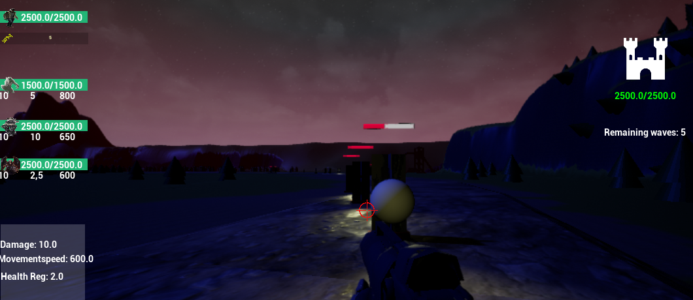

# Personal Portfolio 

* My Projects

** There Will be Monsters (WIP)

*** Images

*** Description
There willl be monsters is a fps game where you as the player together with three other non playable characters defend against a attack against your base. 

You as the player will be able to direct your three allied creatures to position to overcome the army.

*** Tools
* Blender, 
* Unreal Engine 4 (v4.25), 

** Scouts Causeway (WIP)

*** Description

Take the role of a scout from one of six civilizations during the bronze age to discover this hexagon world that you all share. Find materials to make equipment and trade to take you through harsh deserts to unforgiving articlandscapes. 

The game will end when you either have discovered a full map of all tiles or met an unfortunate faith in this unknown world.

*** Tools
* Blender, 
* Unreal Engine 4 (v4.25), 
